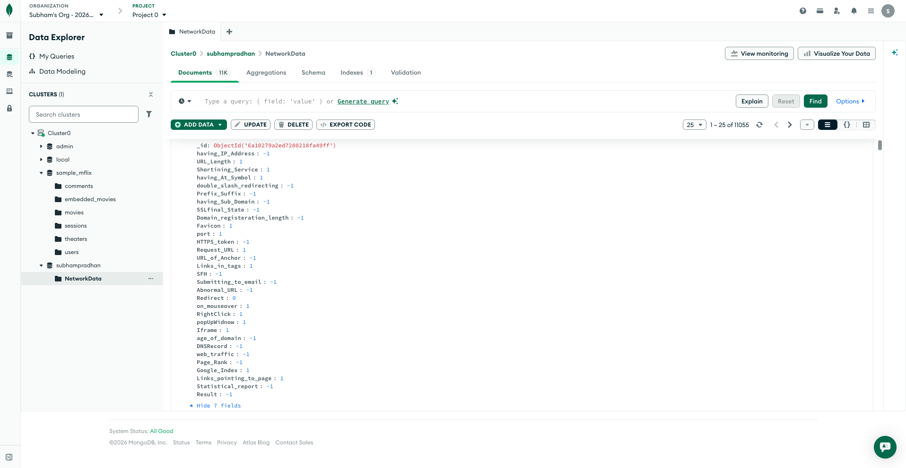
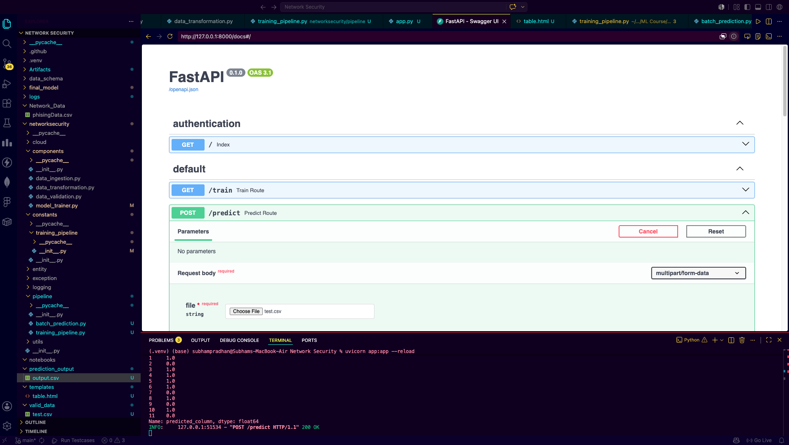
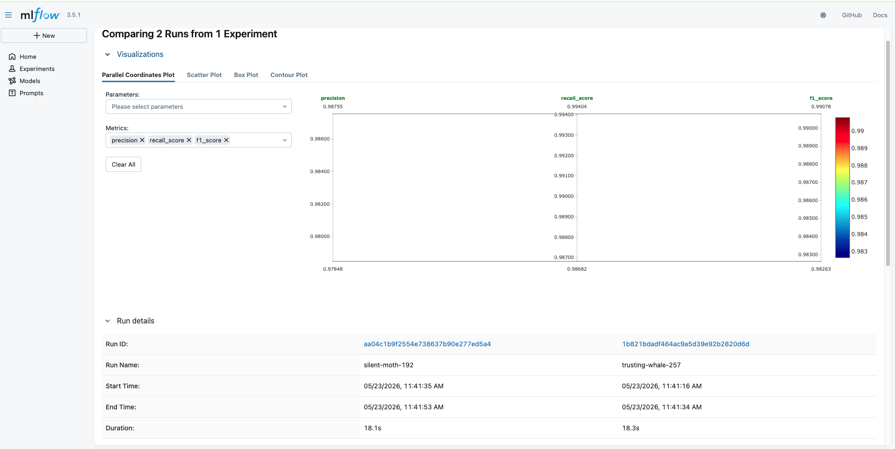
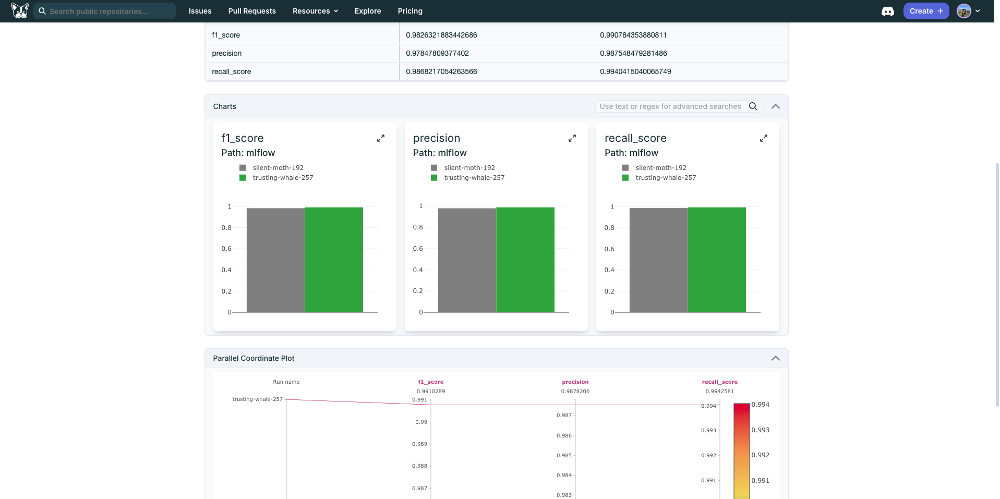

# 🛡️ Network Security Phishing Detection

> An end-to-end machine learning pipeline that detects phishing attacks and malicious network traffic with automated validation, transformation, and model training.

## 📸 Project Visualization & Screenshots

### 1. MongoDB Data Storage


The system stores all network security data in **MongoDB Atlas**. Key observations:
- **Collection**: `NetworkData` contains phishing records
- **Schema**: Features include URL characteristics, SSL indicators, domain properties
- Multiple security-related attributes visible in the explorer
...

### 2. FastAPI Prediction Endpoint


The **FastAPI interactive API documentation** showing:
- **GET /train**: Endpoint to trigger model training
- **POST /predict**: File upload endpoint for CSV predictions
...

### 3. MLflow Experiment Tracking


The **MLflow tracking dashboard** comparing multiple training runs:
- **Metrics Tracked**: Precision, Recall, F1-Score
- **Run Comparison**: Side-by-side comparison of different versions
...

### 4. Model Metrics & Results


The **detailed model evaluation results** with:
- **Key Performance Metrics**: Precision, Recall, F1-Score
- **Bar Charts**: Visual comparison across runs
...

---

## 📋 Overview

This project is a comprehensive machine learning pipeline for detecting phishing emails and malicious network traffic. It takes raw network security data and automatically processes it through validation, transformation, and model training stages to produce accurate threat predictions.

### What Makes This Special?

Unlike basic ML models, this system implements a **complete data pipeline** with:
- ✅ Automated data validation and quality checks
- ✅ Data drift detection to identify distribution changes
- ✅ Feature transformation and preprocessing
- ✅ Multiple model training with best model selection
- ✅ Real-time predictions via FastAPI
- ✅ Experiment tracking with MLflow for monitoring

---

## 🏗️ Pipeline Architecture

### Complete Workflow Overview

```
┌──────────────────────────────────────────────────────────────┐
│                    DATA INGESTION                             │
│  Raw CSV → MongoDB Storage → Schema Validation               │
└────────────────┬─────────────────────────────────────────────┘
                 │
                 ▼
┌──────────────────────────────────────────────────────────────┐
│                  DATA VALIDATION                              │
│  Check Missing Values → Detect Drift → Verify Schema         │
└────────────────┬─────────────────────────────────────────────┘
                 │
                 ▼
┌──────────────────────────────────────────────────────────────┐
│               DATA TRANSFORMATION                             │
│  Feature Scaling → Normalization → Train-Test Split          │
└────────────────┬─────────────────────────────────────────────┘
                 │
                 ▼
┌──────────────────────────────────────────────────────────────┐
│                 MODEL TRAINING                                │
│  Multi-Algorithm → Cross-Validation → Best Model Selection   │
└────────────────┬─────────────────────────────────────────────┘
                 │
                 ▼
┌──────────────────────────────────────────────────────────────┐
│               MODEL EVALUATION                                │
│  Calculate Metrics → Compare Performance → Accept/Reject     │
└────────────────┬────────────┬────────────────────────────────┘
                 │            │
         ✅ ACCEPTED    ❌ REJECTED
                 │            │
                 ▼            ▼
            Save Model    Flag for Review
```

---

## 📸 System in Action

### 1. MongoDB Data Storage
The system stores all network security data in **MongoDB Atlas**. This cloud database contains:
- **~11,000 records** of network traffic samples
- **40+ features** including URL characteristics, SSL indicators, domain properties
- **Key fields tracked**: 
  - URL-based features (length, presence of special characters, domain info)
  - SSL/TLS indicators (certificate status, HTTPS usage)
  - HTTP request patterns (header information, protocol details)
  - Domain metadata (registration age, whois information)
  - Traffic patterns (redirects, suspicious activities)

**Why MongoDB?** NoSQL flexibility allows storing varied network data formats and scales horizontally as data grows.

---

### 2. Data Ingestion Component
The **data ingestion module** handles:
- Reading CSV files containing raw network data
- Parsing and validating data structure
- Storing clean records in MongoDB collections
- Creating data ingestion artifacts (logs, error reports)
- Supporting multiple source formats and configurations

**Example CSV structure:**
```
url_length, having_ip_address, ssl_final_state, domain_age, ...
45, 0, 1, 10, ...
```

---

### 3. Data Validation Component
Before training, the pipeline validates data quality:
- **Missing Value Detection**: Identifies null columns and incomplete records
- **Data Drift Analysis**: Compares current data distribution with baseline
- **Schema Validation**: Ensures all required features are present
- **Statistical Checks**: Verifies feature ranges and distributions
- **Report Generation**: Creates detailed validation reports

**Output artifacts:**
- `drift_report.json` - Detected data anomalies
- `validation_status.json` - Validation results
- Detailed logs of all validation checks

---

### 4. Data Transformation Component
Raw data becomes ML-ready through:
- **Feature Scaling**: Normalizing numerical features to consistent ranges
- **Encoding**: Converting categorical variables to numerical format
- **Train-Test Split**: Dividing data (typically 70% train, 30% test)
- **Feature Engineering**: Creating derived features from raw data
- **Batch Processing**: Handling large datasets efficiently

**Outputs:**
- `train.npy` - Training data arrays
- `test.npy` - Testing data arrays
- `preprocessor.pkl` - Scaling state for inference

---

### 5. Model Training Component
The system trains multiple models and selects the best:
- **Algorithms tested**: Logistic Regression, Random Forest, Gradient Boosting, etc.
- **Cross-Validation**: k-fold validation to ensure robust performance
- **Hyperparameter Tuning**: Testing different parameter combinations
- **Best Model Selection**: Automatic selection based on validation metrics
- **Model Serialization**: Saving trained model as `model.pkl`

**Key metrics tracked:**
- Accuracy: Overall correctness
- Precision: True positives out of predicted positives
- Recall: True positives out of actual positives
- F1-Score: Harmonic mean of precision and recall

---

### 6. Model Evaluation Component
After training, comprehensive evaluation ensures model quality:
- **Metric Calculation**: Computing precision, recall, F1, accuracy
- **Performance Thresholds**: Checking if metrics meet minimum standards
- **Acceptance Criteria**: Automatic accept/reject based on predefined rules
- **Comparative Analysis**: Comparing against baseline models
- **Artifact Generation**: Saving evaluation reports and metric artifacts

**Decision Logic:**
```
If (precision > threshold AND recall > threshold AND F1 > threshold):
    → ACCEPT model → Ready for predictions
Else:
    → REJECT model → Flag for retraining with different parameters
```

---

## 📊 FastAPI Prediction Server

Once trained, the model serves predictions via a REST API:

### Endpoints

#### 1. GET /train
Triggers the entire ML pipeline
```bash
curl http://localhost:8000/train
# Response: "Training is successful"
```

#### 2. POST /predict
Upload CSV for batch predictions
```bash
curl -X POST "http://localhost:8000/predict" \
  -F "file=@network_data.csv"
```

**Input Format (CSV):**
```
url_length, having_ip_address, ssl_final_state, domain_age, ...
45, 0, 1, 10, ...
```

**Output Format (Enhanced CSV with predictions):**
```
url_length, having_ip_address, ..., predicted_column
45, 0, ..., 1  (1 = Legitimate)
67, 1, ..., -1 (−1 = Phishing)
```

---

## 🧪 Model Performance & Monitoring

### MLflow Experiment Tracking

The project uses **MLflow** to track all training runs and compare models:

**What MLflow tracks:**
1. **Training Parameters** - Hyperparameters used for each model
2. **Performance Metrics** - Precision, recall, F1-score, accuracy
3. **Training Artifacts** - Model files, preprocessing objects
4. **Experiment History** - Complete history of all training attempts

**Benefits:**
- Compare performance across different runs
- Identify best performing configurations
- Track metric improvements over time
- Maintain reproducibility

**View metrics:**
```bash
mlflow ui  # Opens dashboard at http://localhost:5000
```

---

## 🛠️ Tech Stack

| Component | Technology | Purpose |
|-----------|-----------|---------|
| **Backend** | FastAPI | High-performance async API server |
| **Database** | MongoDB Atlas | Cloud data storage with flexibility |
| **ML Framework** | scikit-learn | Model training and evaluation |
| **Data Processing** | pandas, NumPy | Data manipulation and analysis |
| **Experiment Tracking** | MLflow | Monitor and compare model runs |
| **API Docs** | Swagger/OpenAPI | Interactive API documentation |

---

## 📁 Project Structure

```
Network-Security/
│
├── networksecurity/
│   ├── components/
│   │   ├── data_ingestion.py          # Load data → MongoDB
│   │   ├── data_validation.py         # Check quality & drift
│   │   ├── data_transformation.py     # Scale & engineer features
│   │   ├── model_trainer.py           # Train multiple algorithms
│   │   └── model_evaluation.py        # Evaluate & accept/reject
│   │
│   ├── pipeline/
│   │   └── training_pipeline.py       # Orchestrate entire workflow
│   │
│   ├── utils/
│   │   ├── main_utils/                # Utility functions
│   │   └── ml_utils/                  # ML-specific helpers
│   │
│   ├── exception/                     # Custom error handling
│   ├── logging/                       # Structured logging
│   └── constants/                     # Configuration constants
│
├── final_model/
│   ├── model.pkl                      # Trained model weights
│   └── preprocessor.pkl               # Feature scaler state
│
├── artifacts/                         # Pipeline outputs & logs
├── logs/                              # Detailed application logs
├── valid_data/                        # Validated datasets
│
├── main.py                            # FastAPI app entry point
├── requirements.txt                   # Python dependencies
└── README.md
```

---

## 🚀 Getting Started

### Prerequisites
- Python 3.9+
- MongoDB Atlas account (free tier available)
- ~2GB free disk space

### Installation

1. **Clone repository**
```bash
git clone https://github.com/subh737/Network-Security.git
cd Network-Security
```

2. **Create virtual environment**
```bash
python -m venv venv
source venv/bin/activate  # Windows: venv\Scripts\activate
```

3. **Install dependencies**
```bash
pip install -r requirements.txt
```

4. **Set environment variables**
```bash
export MONGODB_URL_KEY="your_mongodb_connection_string"
```

---

## 📈 Running the Pipeline

### Train a New Model
```bash
python main.py
```

This will:
1. Ingest raw data from configured source
2. Validate data quality and check for drift
3. Transform features and split into train/test
4. Train multiple ML models
5. Evaluate performance and select best model
6. Save trained model and preprocessor

### Start the Prediction API
```bash
uvicorn main:app --reload --host localhost --port 8000
```

Visit `http://localhost:8000/docs` to test the API with Swagger UI.

### Make Predictions
```bash
# Upload CSV file and get predictions
curl -X POST "http://localhost:8000/predict" \
  -F "file=@test_data.csv"
```

---

## 📊 Understanding the Output

### Prediction Values
- **1 or positive values** → Legitimate traffic (not phishing)
- **-1 or 0** → Phishing detected (malicious)

### Example Workflow

**Input CSV:**
```
url_length, having_ip_address, domain_age, ...
50, 0, 15, ...
120, 1, 2, ...
```

**Output CSV (with predictions):**
```
url_length, having_ip_address, domain_age, ..., predicted_column
50, 0, 15, ..., 1        ✅ Legitimate
120, 1, 2, ..., -1       ⚠️ Phishing Detected
```

---

## 🔍 Data Quality Monitoring

The pipeline includes built-in data quality checks:

### Validation Checks
- **Missing Values**: Counts null values per column
- **Data Types**: Ensures correct data types
- **Value Ranges**: Verifies features are within expected ranges
- **Distribution Drift**: Detects changes in feature distributions
- **Duplicates**: Identifies and handles duplicate records

### Generated Reports
All validation results are saved as:
- `data_validation_report.json` - Detailed validation results
- `drift_report.json` - Identified data drift issues
- Validation logs in `logs/` directory

---

## 💡 Key Design Decisions

**Why this architecture?**

1. **MongoDB for Storage**: Flexible schema handles varied network data
2. **Modular Components**: Each stage (ingest, validate, transform, train) is independent
3. **MLflow Tracking**: Reproducibility and experiment comparison
4. **FastAPI**: Modern, fast, auto-documented API
5. **Automated Validation**: Catches data issues before they break models

---

## 🤝 Contributing

Areas for improvement:
- Real-time streaming predictions
- Advanced threat classification models
- Additional feature engineering techniques
- Performance optimization for large datasets
- Explainability features (SHAP values, feature importance)

---

## 📝 License

This project is open source under the MIT License.

---

## 📚 Further Reading

- [FastAPI Documentation](https://fastapi.tiangolo.com/)
- [MongoDB Atlas Guide](https://docs.mongodb.com/manual/)
- [scikit-learn ML Guide](https://scikit-learn.org/stable/)
- [MLflow Documentation](https://mlflow.org/docs/latest/)

---

**Built for detecting network security threats with machine learning**